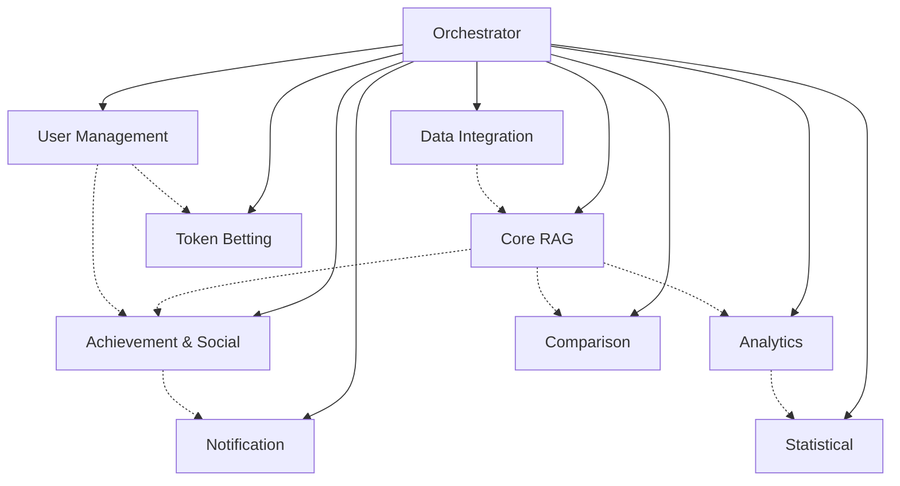

# Self-Improving RAG Platform: Modular Architecture Plan

## Overview

This architecture plan organizes the 19 TDD cycles into **9 independent modules** plus **1 orchestrator module**, following hexagonal architecture principles. Each module is designed to be under 30k tokens, independently testable, and API-accessible.

---

## Architecture Principles

### **1. Hexagonal Architecture (Ports & Adapters)**
```
┌─────────────────────────────────────────────────────────┐
│                    API Layer                            │
│                 (HTTP Controllers)                      │
└─────────────────────┬───────────────────────────────────┘
                      │
┌─────────────────────┴───────────────────────────────────┐
│              Application Layer                          │
│            (Use Cases / Services)                       │
└─────────────────────┬───────────────────────────────────┘
                      │
┌─────────────────────┴───────────────────────────────────┐
│                Domain Layer                             │
│            (Business Logic / Entities)                  │
└─────────────────────┬───────────────────────────────────┘
                      │
┌─────────────────────┴───────────────────────────────────┐
│            Infrastructure Layer                         │
│         (Repositories / External APIs)                  │
└─────────────────────────────────────────────────────────┘
```

### **2. Module Independence**
- Each module can be deployed independently
- Clear boundaries with defined contracts
- No direct dependencies between modules (only through orchestrator)
- Independent testing and development

### **3. Standard Module Structure**
```
ModuleName/
├── Domain/
│   ├── Entities/
│   ├── ValueObjects/
│   ├── Services/
│   └── Events/
├── Application/
│   ├── UseCases/
│   ├── Services/
│   ├── DTOs/
│   └── Interfaces/
├── Infrastructure/
│   ├── Repositories/
│   ├── ExternalServices/
│   └── Configuration/
├── API/
│   ├── Controllers/
│   ├── Middleware/
│   └── Models/
├── Tests/
│   ├── Unit/
│   ├── Integration/
│   └── E2E/
└── Documentation/
    └── module_readme.md
```

---

## Module Breakdown

### **Module 1: Orchestrator Module**
**Responsibility**: Coordinates all modules, main API gateway, cross-module workflows
**Size**: ~25k tokens
**TDD Cycles**: Integration workflows from Cycle 9

**Core Components**:
```typescript
// Main orchestrator interface
interface IOrchestrator {
    processUserQuery(query: UserQuery): Promise<QueryResult>;
    runOptimizationWorkflow(buildId: string): Promise<OptimizationResult>;
    handleUserAction(action: UserAction): Promise<ActionResult>;
}
```

**Key Responsibilities**:
- API Gateway and routing
- Module coordination
- Workflow orchestration
- Authentication & authorization
- Rate limiting & monitoring
- Event distribution

---

### **Module 2: Core RAG Module**
**Responsibility**: Context builds, optimization, query processing
**Size**: ~28k tokens
**TDD Cycles**: 1, 2, 7

**Domain Entities**:
```typescript
class ContextBuild {
    id: BuildId;
    name: string;
    domain: string;
    elements: ContextElement[];
    metrics: PerformanceMetrics;
    
    optimize(): OptimizationResult;
    processQuery(query: string): QueryResponse;
}

class ContextElement {
    name: string;
    content: string;
    tokenBudget: number;
    causalImpact: number;
}
```

**Application Services**:
- `ContextBuildService`
- `OptimizationService` 
- `QueryProcessingService`

**Infrastructure**:
- `LLMGateway`
- `ContextBuildRepository`
- `OptimizationResultRepository`

---

### **Module 3: User Management Module**
**Responsibility**: User profiles, gamification, XP, levels
**Size**: ~26k tokens
**TDD Cycles**: 10

**Domain Entities**:
```typescript
class User {
    id: UserId;
    profile: UserProfile;
    gamification: GamificationStats;
    
    gainExperience(points: number): LevelUpResult;
    updateProfile(changes: ProfileUpdate): void;
}

class GamificationStats {
    level: Level;
    experiencePoints: ExperiencePoints;
    winStreak: WinStreak;
    totalOptimizations: number;
}
```

**Application Services**:
- `UserManagementService`
- `GamificationService`
- `ProfileService`

**API Endpoints**:
- `GET /users/{id}`
- `POST /users`
- `PUT /users/{id}/experience`
- `GET /users/{id}/stats`

---

### **Module 4: Achievement & Social Module**
**Responsibility**: Achievements, leaderboards, social features
**Size**: ~27k tokens
**TDD Cycles**: 11, 12

**Domain Entities**:
```typescript
class Achievement {
    id: AchievementId;
    name: string;
    description: string;
    rarity: AchievementRarity;
    trigger: AchievementTrigger;
    xpReward: ExperiencePoints;
    
    checkUnlock(stats: UserStatistics): boolean;
}

class Leaderboard {
    period: LeaderboardPeriod;
    rankings: LeaderboardEntry[];
    
    updateRankings(performances: UserPerformance[]): void;
    getRanking(userId: UserId): LeaderboardPosition;
}
```

**Application Services**:
- `AchievementService`
- `LeaderboardService`
- `SocialComparisonService`

**API Endpoints**:
- `GET /achievements`
- `POST /achievements/{id}/unlock`
- `GET /leaderboards/{period}`
- `GET /users/{id}/achievements`

---

### **Module 5: Notification Module**
**Responsibility**: Real-time notifications, preferences, delivery
**Size**: ~24k tokens
**TDD Cycles**: 13

**Domain Entities**:
```typescript
class Notification {
    id: NotificationId;
    userId: UserId;
    type: NotificationType;
    content: NotificationContent;
    priority: NotificationPriority;
    
    deliver(channels: DeliveryChannel[]): DeliveryResult;
}

class NotificationPreferences {
    userId: UserId;
    channelPreferences: Map<NotificationType, DeliveryChannel[]>;
    
    allowsNotification(type: NotificationType): boolean;
}
```

**Application Services**:
- `NotificationService`
- `PreferencesService`
- `DeliveryService`

**Infrastructure**:
- `WebSocketChannel`
- `EmailChannel`
- `PushNotificationChannel`

**API Endpoints**:
- `POST /notifications`
- `GET /users/{id}/notifications`
- `PUT /users/{id}/notification-preferences`
- `WebSocket /notifications/stream`

---

### **Module 6: Data Integration Module**
**Responsibility**: Company data sources, MCP servers, ingestion
**Size**: ~29k tokens
**TDD Cycles**: 5, 14

**Domain Entities**:
```typescript
class DataSource {
    id: DataSourceId;
    type: DataSourceType;
    configuration: DataSourceConfig;
    qualityMetrics: QualityMetrics;
    
    ingest(): IngestionResult;
    assessQuality(): QualityScore;
}

class MCPServer {
    id: MCPServerId;
    domain: string;
    healthStatus: HealthStatus;
    dataQuality: QualityScore;
    
    sync(): SyncResult;
    getStatus(): ServerStatus;
}
```

**Application Services**:
- `DataIngestionService`
- `MCPServerService`
- `QualityAssessmentService`

**Infrastructure**:
- `SlackAPIClient`
- `GitHubAPIClient`
- `JiraAPIClient`
- `ConfluenceAPIClient`

**API Endpoints**:
- `GET /data-sources`
- `POST /data-sources/{id}/sync`
- `GET /mcp-servers`
- `GET /mcp-servers/{id}/status`

---

### **Module 7: Analytics Module**
**Responsibility**: Performance tracking, A/B testing, advanced analytics
**Size**: ~29k tokens
**TDD Cycles**: 4, 16, 17

**Domain Entities**:
```typescript
class ABTest {
    id: ABTestId;
    name: string;
    controlBuild: BuildId;
    variantBuild: BuildId;
    configuration: ABTestConfig;
    
    start(): void;
    analyze(): ABTestResults;
    stop(): void;
}

class PerformanceMetrics {
    successRate: SuccessRate;
    tokenEfficiency: TokenEfficiency;
    timeToGreen: Duration;
    confidenceScore: ConfidenceScore;
    
    compare(other: PerformanceMetrics): MetricComparison;
}
```

**Application Services**:
- `PerformanceTrackingService`
- `ABTestingService`
- `AnalyticsService`

**API Endpoints**:
- `GET /analytics/performance`
- `POST /ab-tests`
- `GET /ab-tests/{id}/results`
- `GET /analytics/usage`

---

### **Module 8: Statistical Module**
**Responsibility**: Uncertainty quantification, causal inference
**Size**: ~29k tokens
**TDD Cycles**: 18, 19

**Domain Entities**:
```typescript
class UncertaintyAnalysis {
    epistemicUncertainty: EpistemicUncertainty;
    aleatoricUncertainty: AleatoricUncertainty;
    totalUncertainty: TotalUncertainty;
    
    decompose(): UncertaintyDecomposition;
    calculatePACBounds(): PACBayesianBounds;
}

class CausalGraph {
    nodes: CausalNode[];
    edges: CausalEdge[];
    confounders: Confounder[];
    
    estimateEffect(intervention: Intervention): CausalEffect;
    identifyConfounders(): Confounder[];
}
```

**Application Services**:
- `UncertaintyQuantificationService`
- `CausalInferenceService`
- `StatisticalAnalysisService`

**API Endpoints**:
- `POST /statistics/uncertainty`
- `POST /statistics/causal-analysis`
- `GET /statistics/pac-bounds`

---

### **Module 9: Comparison Module**
**Responsibility**: Build comparison, statistical significance testing
**Size**: ~23k tokens
**TDD Cycles**: 15

**Domain Entities**:
```typescript
class BuildComparison {
    buildA: ContextBuild;
    buildB: ContextBuild;
    differences: PerformanceDifference[];
    significance: StatisticalSignificance;
    
    analyze(): ComparisonResult;
    generateRecommendations(): Recommendation[];
}

class StatisticalSignificance {
    pValue: number;
    confidenceLevel: number;
    isSignificant: boolean;
    
    validate(): SignificanceValidation;
}
```

**Application Services**:
- `BuildComparisonService`
- `StatisticalTestingService`

**API Endpoints**:
- `POST /comparisons`
- `GET /comparisons/{id}`
- `GET /comparisons/{id}/recommendations`

---

### **Module 10: Token Betting Module**
**Responsibility**: Gamified betting system, token economy
**Size**: ~22k tokens
**TDD Cycles**: 3

**Domain Entities**:
```typescript
class TokenBet {
    id: BetId;
    userId: UserId;
    buildId: BuildId;
    tokenAmount: TokenAmount;
    prediction: OptimizationPrediction;
    odds: BettingOdds;
    
    resolve(actualResult: OptimizationResult): BetResult;
    calculatePayout(): TokenAmount;
}

class TokenWallet {
    userId: UserId;
    balance: TokenBalance;
    transactions: TokenTransaction[];
    
    deduct(amount: TokenAmount): DeductionResult;
    credit(amount: TokenAmount): void;
}
```

**Application Services**:
- `TokenBettingService`
- `WalletService`
- `OddsCalculationService`

**API Endpoints**:
- `POST /bets`
- `GET /users/{id}/bets`
- `GET /users/{id}/wallet`
- `POST /users/{id}/wallet/credit`

---

## Module Communication Architecture

### **Event-Driven Communication**
```typescript
interface ModuleEvent {
    id: EventId;
    type: EventType;
    source: ModuleId;
    data: EventData;
    timestamp: DateTime;
}

// Example events
class OptimizationCompletedEvent implements ModuleEvent {
    buildId: BuildId;
    result: OptimizationResult;
    userId: UserId;
}

class AchievementUnlockedEvent implements ModuleEvent {
    userId: UserId;
    achievementId: AchievementId;
    xpAwarded: ExperiencePoints;
}
```

### **Module Dependencies**


**Legend**: Solid lines = Direct API calls, Dotted lines = Event-driven communication

---

## API Gateway Structure

### **Orchestrator API Routes**
```typescript
// Main workflow endpoints
POST   /api/v1/queries              // Process user query
POST   /api/v1/optimizations        // Start optimization
GET    /api/v1/workflows/{id}       // Get workflow status

// Module proxy endpoints
/api/v1/core/*                      // Route to Core RAG Module
/api/v1/users/*                     // Route to User Management Module
/api/v1/achievements/*              // Route to Achievement Module
/api/v1/notifications/*             // Route to Notification Module
/api/v1/data-sources/*              // Route to Data Integration Module
/api/v1/analytics/*                 // Route to Analytics Module
/api/v1/statistics/*                // Route to Statistical Module
/api/v1/comparisons/*               // Route to Comparison Module
/api/v1/bets/*                      // Route to Token Betting Module
```

### **Authentication & Authorization**
```typescript
interface ModuleSecurityContext {
    userId: UserId;
    roles: Role[];
    permissions: Permission[];
    tokenBudget: TokenBudget;
}

// Each module enforces its own authorization
interface ModuleAuthorization {
    hasPermission(context: SecurityContext, action: string): boolean;
    checkTokenBudget(context: SecurityContext, cost: number): boolean;
}
```

---

## Deployment Architecture

### **Container Structure**
```yaml
# docker-compose.yml
services:
  orchestrator:
    image: selfrag/orchestrator:latest
    ports: ["8000:8000"]
    environment:
      - MODULE_DISCOVERY_URL=http://consul:8500
    
  core-rag:
    image: selfrag/core-rag:latest
    ports: ["8001:8000"]
    
  user-management:
    image: selfrag/user-management:latest
    ports: ["8002:8000"]
    
  achievement-social:
    image: selfrag/achievement-social:latest
    ports: ["8003:8000"]
    
  notification:
    image: selfrag/notification:latest
    ports: ["8004:8000"]
    
  data-integration:
    image: selfrag/data-integration:latest
    ports: ["8005:8000"]
    
  analytics:
    image: selfrag/analytics:latest
    ports: ["8006:8000"]
    
  statistical:
    image: selfrag/statistical:latest
    ports: ["8007:8000"]
    
  comparison:
    image: selfrag/comparison:latest
    ports: ["8008:8000"]
    
  token-betting:
    image: selfrag/token-betting:latest
    ports: ["8009:8000"]
```

### **Infrastructure Dependencies**
```yaml
  # Shared infrastructure
  postgres:
    image: postgres:15
    environment:
      POSTGRES_DB: selfrag
      
  redis:
    image: redis:7
    
  rabbitmq:
    image: rabbitmq:3-management
    
  consul:
    image: consul:latest
    
  prometheus:
    image: prom/prometheus:latest
    
  grafana:
    image: grafana/grafana:latest
```

---

## Testing Strategy

### **Module-Level Testing**
```typescript
// Each module has comprehensive test suites
interface ModuleTestSuite {
    unitTests: UnitTestSuite;           // Domain & Application logic
    integrationTests: IntegrationTestSuite; // Infrastructure integration
    contractTests: ContractTestSuite;   // API contract validation
    e2eTests: E2ETestSuite;             // End-to-end scenarios
}
```

### **Cross-Module Testing**
```typescript
// Orchestrator runs integration tests across modules
interface CrossModuleTestSuite {
    workflowTests: WorkflowTestSuite;   // Complete user workflows
    eventTests: EventTestSuite;         // Event-driven communication
    performanceTests: PerformanceTestSuite; // Load and stress testing
}
```

---

## Development Workflow

### **Module Development Process**
1. **TDD Implementation**: Follow the specific TDD cycles for each module
2. **Independent Testing**: Each module runs its complete test suite
3. **Contract Validation**: Verify API contracts with other modules
4. **Integration Testing**: Test with orchestrator
5. **Deployment**: Independent deployment pipeline per module

### **Module Documentation Requirements**
Each module must include:
- **Architecture Documentation** (~10k tokens)
- **API Documentation** (~8k tokens)
- **Domain Model Documentation** (~6k tokens)
- **Testing Guide** (~4k tokens)
- **Deployment Guide** (~2k tokens)

**Total per module**: ~30k tokens

---

## Implementation Phases

### **Phase 1: Foundation (Weeks 1-3)**
1. **Orchestrator Module** - Basic API gateway and routing
2. **Core RAG Module** - Essential context build functionality
3. **User Management Module** - Basic user profiles and authentication

### **Phase 2: Core Features (Weeks 4-6)**
4. **Token Betting Module** - Gamification core
5. **Analytics Module** - Performance tracking
6. **Notification Module** - Real-time updates

### **Phase 3: Advanced Features (Weeks 7-9)**
7. **Achievement & Social Module** - Leaderboards and achievements
8. **Data Integration Module** - Company data sources
9. **Comparison Module** - Build comparison tools

### **Phase 4: AI/ML Features (Weeks 10-12)**
10. **Statistical Module** - Uncertainty quantification and causal inference

---

## Quality Assurance

### **Module Quality Gates**
- ✅ **Test Coverage**: Minimum 85% code coverage
- ✅ **Performance**: Response time under 200ms for 95% of requests
- ✅ **Memory**: Module size under 30k tokens
- ✅ **Documentation**: Complete API and domain documentation
- ✅ **Security**: Authentication and authorization implemented
- ✅ **Monitoring**: Health checks and metrics exposed

### **Integration Quality Gates**
- ✅ **Event Delivery**: 99.9% event delivery success rate
- ✅ **API Contracts**: All contracts validated and versioned
- ✅ **Error Handling**: Graceful degradation when modules are unavailable
- ✅ **Consistency**: Data consistency across module boundaries

---

## Success Metrics

### **Module Independence**
- Each module can be deployed independently ✅
- Module failures don't cascade ✅
- Development teams can work in parallel ✅

### **Scalability**
- Individual modules can be scaled based on demand ✅
- New modules can be added without changing existing ones ✅
- Performance scales linearly with module instances ✅

### **Maintainability**
- Clear boundaries and responsibilities ✅
- Comprehensive documentation ✅
- Test-driven development throughout ✅

This modular architecture provides a solid foundation for building the Self-Improving RAG Platform with independent, testable, and scalable components. Each module follows the same architectural patterns while maintaining clear boundaries and responsibilities. 