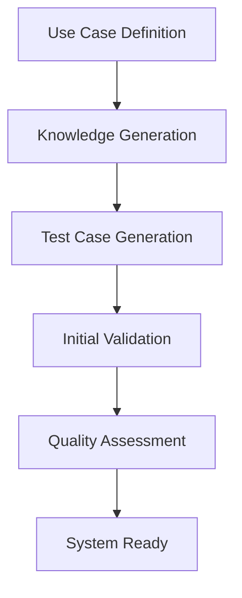
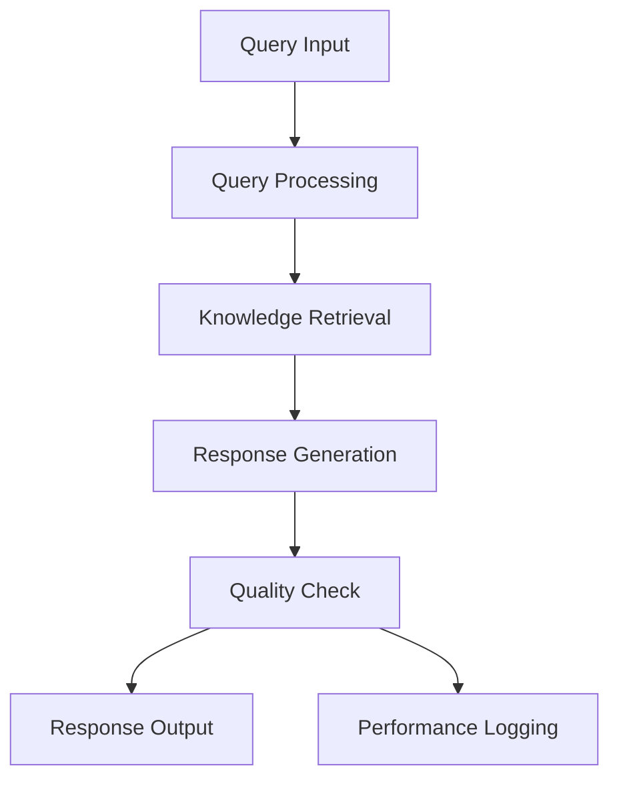
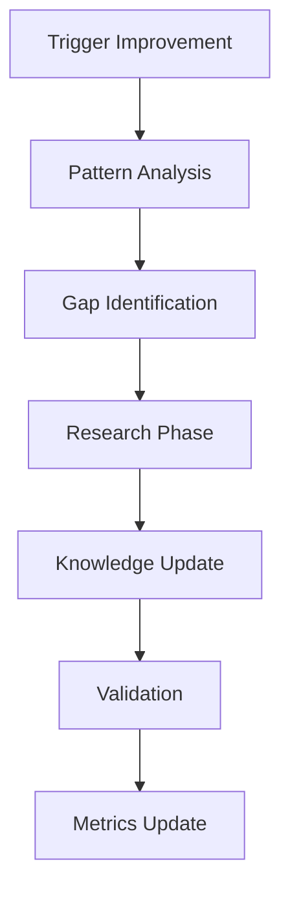

# Self-Improving RAG System: Technical Documentation

## System Architecture

### Core Components

#### 1. Knowledge Management System
```
KnowledgeBaseManager
├── Vector Store (ChromaDB)
│   ├── Document Storage
│   └── Embedding Management
├── Version Control
│   ├── State Snapshots
│   └── Change Tracking
└── Quality Metrics
    ├── Accuracy Tracking
    ├── Coverage Analysis
    └── Consistency Validation
```

#### 2. Test Management System
```
TestManager
├── Test Case Generation
│   ├── Core Concept Tests
│   ├── Edge Case Tests
│   └── Performance Tests
├── Coverage Analysis
│   ├── Knowledge Coverage
│   ├── Scenario Coverage
│   └── Gap Detection
└── Test Execution
    ├── Automated Testing
    ├── Results Analysis
    └── Quality Metrics
```

#### 3. Pattern Recognition System
```
PatternAnalyzer
├── Problem Clustering
│   ├── DBSCAN Algorithm
│   └── Semantic Similarity
├── Pattern Identification
│   ├── Frequency Analysis
│   ├── Impact Assessment
│   └── Root Cause Analysis
└── Solution Generation
    ├── Fix Proposals
    ├── Implementation Plans
    └── Validation Criteria
```

#### 4. Performance Monitoring
```
PerformanceMonitor
├── Metric Collection
│   ├── Query Timing
│   ├── Resource Usage
│   └── Success Rates
├── Bottleneck Detection
│   ├── Threshold Analysis
│   ├── Trend Detection
│   └── Impact Assessment
└── Optimization
    ├── Resource Management
    ├── Query Optimization
    └── Cache Management
```

#### 5. Recovery Management
```
RecoveryManager
├── Regression Detection
│   ├── Metric Analysis
│   ├── Pattern Detection
│   └── Impact Assessment
├── Recovery Planning
│   ├── Action Generation
│   ├── Risk Assessment
│   └── Resource Planning
└── Execution
    ├── Action Implementation
    ├── State Verification
    └── Impact Monitoring
```

### Data Models

#### Core Data Structures
```python
class Document:
    content: str
    source: str
    timestamp: datetime
    metadata: Dict[str, Any]
    confidence_score: float
    validation_status: str

class KnowledgeVersionState:
    id: str
    timestamp: datetime
    documents: List[Document]
    quality_metrics: QualityMetrics
    test_results: Dict[str, Any]
    metadata: Dict[str, Any]

class QualityMetrics:
    accuracy: float
    coverage: float
    consistency: float
    source_reliability: float
    test_quality: float
    problem_resolution_rate: float

class TestCase:
    id: str
    query: str
    expected_response: str
    context_requirements: List[str]
    validation_criteria: List[str]
    importance: float
    category: str
```

### API Endpoints

#### 1. RAG Management
```
POST /rag/create
- Creates new RAG instance
- Parameters: use_case_definition
- Returns: rag_id, initial_state

POST /rag/{rag_id}/query
- Queries RAG system
- Parameters: query_text
- Returns: response, confidence

POST /rag/{rag_id}/improve
- Triggers improvement cycle
- Parameters: cycles_count
- Returns: improvement_results
```

#### 2. Problem Management
```
POST /rag/{rag_id}/problem
- Reports problem
- Parameters: problem_definition
- Returns: resolution_plan

GET /rag/{rag_id}/problems
- Gets problem history
- Returns: problem_list, patterns

POST /rag/{rag_id}/fix
- Implements fix
- Parameters: fix_definition
- Returns: fix_results
```

### System Flows

#### 1. Initialization Flow


#### 2. Query Flow


#### 3. Improvement Flow


### Component Interactions

#### 1. Knowledge Update Process
```sequence
KnowledgeManager->PatternAnalyzer: Request Analysis
PatternAnalyzer->TestManager: Generate Tests
TestManager->KnowledgeManager: Test Results
KnowledgeManager->RecoveryManager: Validate Changes
RecoveryManager->KnowledgeManager: Confirmation
```

#### 2. Problem Resolution Process
```sequence
ProblemHandler->PatternAnalyzer: Analyze Problem
PatternAnalyzer->KnowledgeManager: Request Context
KnowledgeManager->PatternAnalyzer: Context Data
PatternAnalyzer->RecoveryManager: Propose Fix
RecoveryManager->KnowledgeManager: Implement Fix
```

### Implementation Details

#### 1. Vector Store Management
```python
class VectorStoreManager:
    def add_document(self, doc: Document):
        # Preprocess document
        # Generate embeddings
        # Store in ChromaDB
        # Update metadata

    def query(self, query: str) -> List[Document]:
        # Generate query embedding
        # Perform similarity search
        # Return relevant documents
```

#### 2. Test Generation
```python
class TestGenerator:
    def generate_tests(self, use_case: UseCase) -> List[TestCase]:
        # Analyze use case
        # Generate core tests
        # Generate edge cases
        # Validate test quality
        # Return test suite
```

#### 3. Pattern Analysis
```python
class PatternAnalyzer:
    def analyze_patterns(self, problems: List[Problem]):
        # Cluster similar problems
        # Identify patterns
        # Assess impact
        # Generate fixes
```

### Configuration

#### 1. System Configuration
```yaml
system:
  max_concurrent_operations: 10
  improvement_cycle_limit: 5
  quality_thresholds:
    accuracy: 0.95
    coverage: 0.90
    consistency: 0.95

vector_store:
  chunk_size: 1000
  overlap: 100
  similarity_threshold: 0.85

performance:
  max_query_time: 1000  # ms
  cache_size: 1000
  max_memory_usage: 0.8  # 80%
```

#### 2. Quality Thresholds
```yaml
quality:
  metrics:
    min_accuracy: 0.95
    min_coverage: 0.90
    min_consistency: 0.95
    min_test_quality: 0.90

  thresholds:
    regression_threshold: 0.1
    improvement_threshold: 0.05
    pattern_significance: 0.2
```

### Error Handling

#### 1. Error Types
```python
class RAGError(Exception):
    """Base error for RAG system"""
    pass

class KnowledgeError(RAGError):
    """Knowledge base related errors"""
    pass

class TestError(RAGError):
    """Test related errors"""
    pass

class PatternError(RAGError):
    """Pattern analysis errors"""
    pass
```

#### 2. Error Recovery
```python
class ErrorHandler:
    def handle_error(self, error: RAGError):
        # Log error
        # Assess impact
        # Initiate recovery
        # Update metrics
```

### Monitoring and Logging

#### 1. Metrics Collection
```python
class MetricsCollector:
    def collect_metrics(self):
        # Gather performance metrics
        # Collect quality metrics
        # Calculate derived metrics
        # Store metrics
```

#### 2. Logging System
```python
class LogManager:
    def log_operation(self, operation: str, details: Dict):
        # Format log entry
        # Add context
        # Store log
        # Trigger alerts if needed
```

### Security Considerations

1. Data Protection
   - Encryption at rest
   - Secure API endpoints
   - Access control
   - Audit logging

2. Operation Security
   - Input validation
   - Output sanitization
   - Resource limits
   - Rate limiting

### Deployment

#### 1. Requirements
```
Runtime:
- Python 3.9+
- ChromaDB
- FastAPI
- LangChain
- Required ML models

Resources:
- Minimum 16GB RAM
- 4+ CPU cores
- SSD storage
```

#### 2. Environment Setup
```bash
# Create virtual environment
python -m venv venv
source venv/bin/activate

# Install dependencies
pip install -r requirements.txt

# Configure environment
export RAG_CONFIG_PATH=/path/to/config.yaml
export MODEL_PATH=/path/to/models

# Start service
uvicorn main:app --host 0.0.0.0 --port 8000
```

### Testing Framework

#### 1. Unit Tests
```python
class TestRAGSystem:
    def test_knowledge_addition(self):
        # Test knowledge addition
        
    def test_pattern_recognition(self):
        # Test pattern recognition
        
    def test_improvement_cycle(self):
        # Test improvement process
```

#### 2. Integration Tests
```python
class TestRAGIntegration:
    def test_full_cycle(self):
        # Test complete system flow
        
    def test_recovery(self):
        # Test recovery process
        
    def test_performance(self):
        # Test performance metrics
```

### Performance Optimization

1. Caching Strategy
   - Query result caching
   - Embedding caching
   - Test result caching

2. Resource Management
   - Memory usage optimization
   - CPU utilization control
   - Storage optimization

3. Query Optimization
   - Vector search optimization
   - Result ranking improvement
   - Response generation optimization

### Maintenance Procedures

1. Regular Maintenance
   - Knowledge base cleanup
   - Index optimization
   - Cache cleanup
   - Log rotation

2. Emergency Procedures
   - System recovery
   - Data recovery
   - Performance recovery

Would you like me to:
1. Expand any section with more detail?
2. Add implementation examples for specific components?
3. Include more configuration examples?
4. Add deployment scenarios?

The documentation covers the technical aspects while avoiding business logic and user-facing documentation, which were covered in the previous document.